# Study Planner · Enfermería

**Planificador de estudio para estudiantes de Enfermería:** organiza asignaturas,
horario, exámenes y temario, **genera un plan día a día hasta cada examen** según
la dificultad de los temas y las horas libres, y avisa con **notificaciones push
aunque la app esté cerrada**. Es una PWA: se instala en el iPhone desde Safari,
sin App Store.

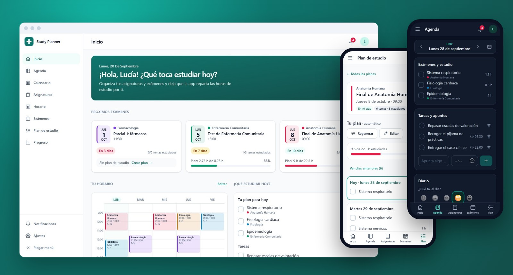

La hice para mi pareja, que estudia Enfermería: apuntaba los exámenes en una
libreta y cada semana rehacía a mano el reparto de temas. La app lo hace sola,
se adapta si se atrasa y le recuerda qué toca cada día.

**Stack:** React 19 · TypeScript · Tailwind CSS 4 · Node 22 · Express 5 ·
MongoDB · Docker Compose · Caddy · Web Push · Gemini (visión)

---

## En 20 segundos

<p align="center">
  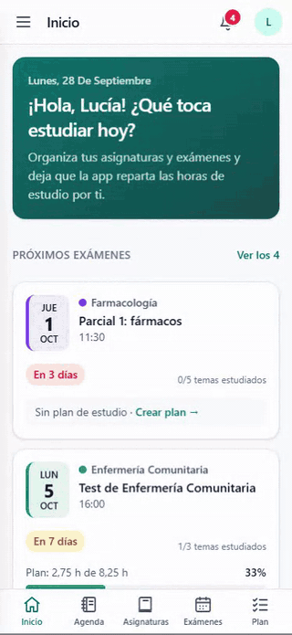
</p>

Marca como hecha la sesión de estudio de hoy, genera el plan del próximo examen
con un toque (vista previa antes de guardar) y apunta una tarea en la agenda.

## Qué hace

- **Plan de estudio automático.** Reparte los temas de cada examen entre los días
  que quedan: más tiempo a los difíciles, repaso final, respeta los días de
  descanso y las horas que ya ocupan otros exámenes. Si se atrasa, lo regenera
  sin perder lo ya hecho. También se puede montar a mano (arrastrar o tocar tema
  → día).
- **Horario semanal escaneado con IA.** Una foto o PDF del horario de la
  universidad se convierte en la tabla de clases (Gemini con salida JSON
  estructurada), que luego se retoca como un calendario de papel.
- **Notificaciones push reales**, también con la app cerrada: exámenes a 7, 3 y 1
  día, qué toca estudiar hoy, retrasos en el plan y felicitación al completarlo.
  A la hora que ella elija y en su zona horaria.
- **Inicio que responde a "¿qué hago hoy?"**: próximos exámenes con cuenta atrás y
  progreso del plan, sesiones y tareas de hoy, y resumen de la semana con el
  cumplimiento del plan.
- **Agenda y diario**: tareas por día (las atrasadas se pueden pasar a hoy) y un
  diario con estado de ánimo que se guarda solo.
- **Calendario** tipo Google Calendar con exámenes y estudio por asignatura.
- **Progreso y estadísticas**: horas por día y por asignatura, racha, horas
  acumuladas y una **preparación estimada** (orientativa) para cada examen.
- **Modo oscuro**, perfil con foto, y todo usable con teclado, lector de pantalla,
  zoom al 200 % y dedos (botones de 44 px como mínimo).

## Capturas

| Plan automático con vista previa | Calendario en modo oscuro |
| --- | --- |
| 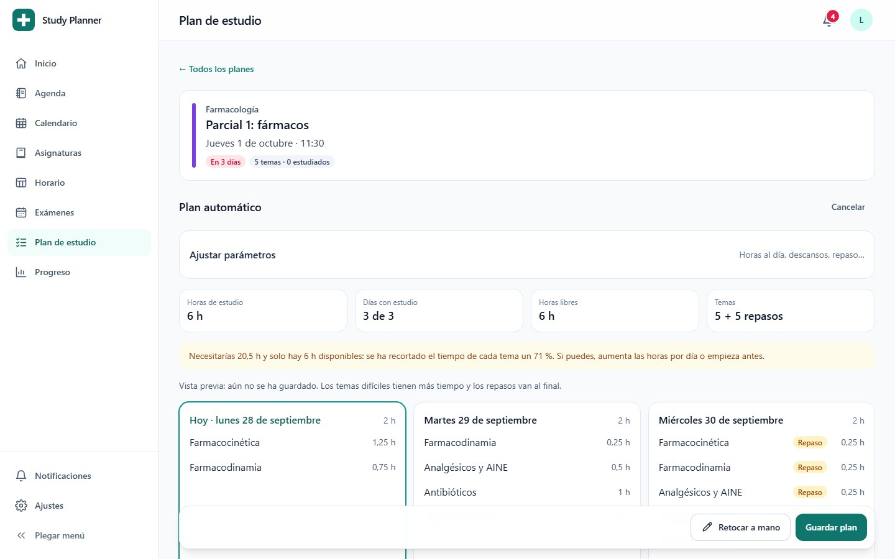 | 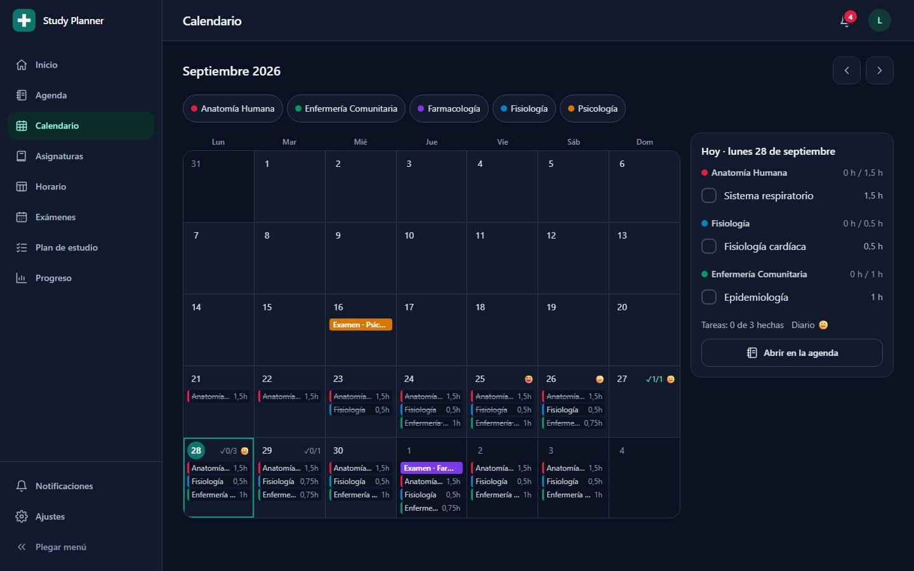 |
| **Asignatura: temario, progreso y exámenes** | **Horario semanal** |
| 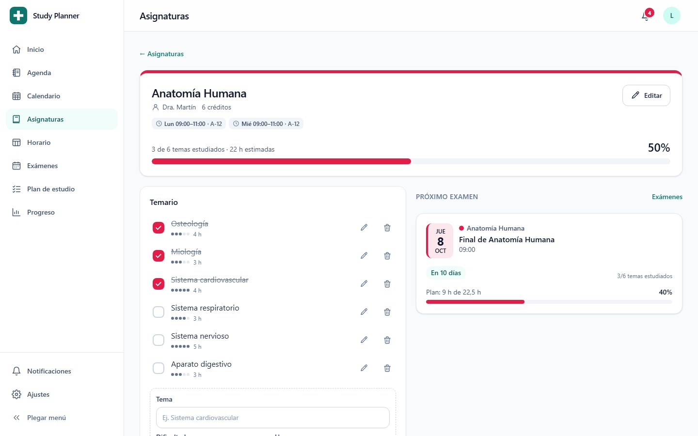 | 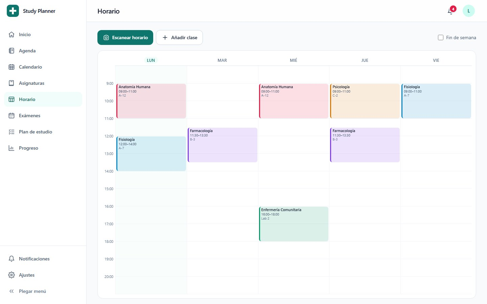 |

<p align="center">
  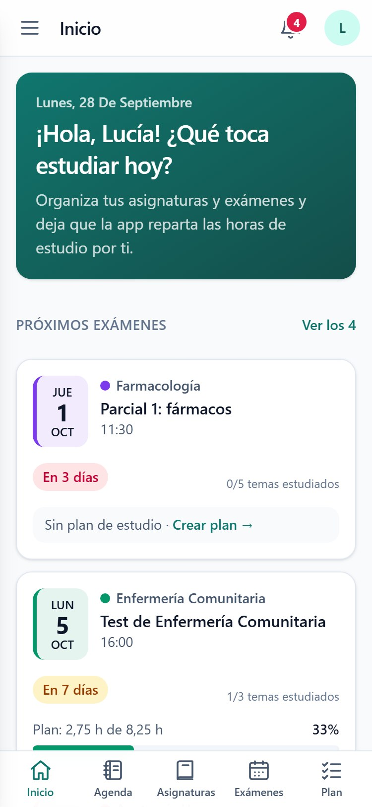
  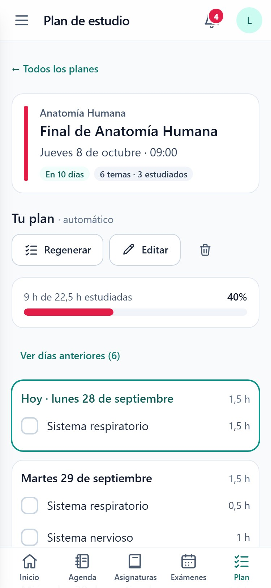
  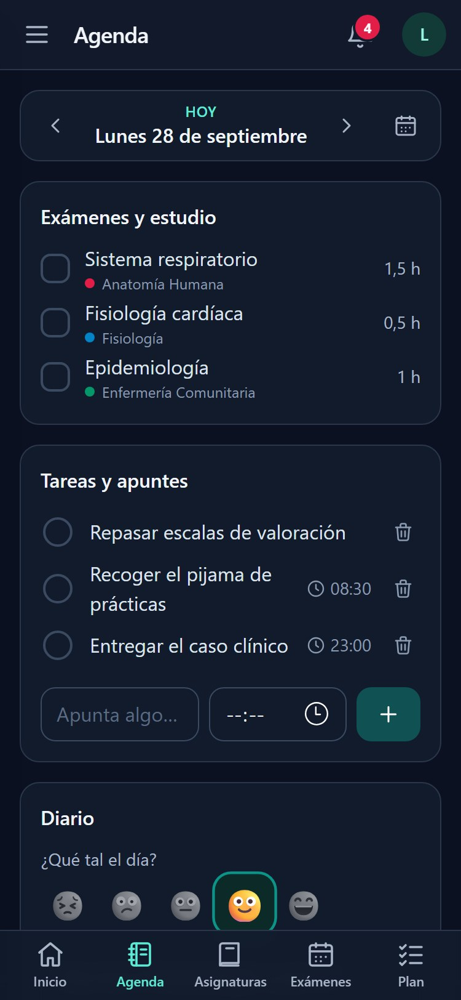
  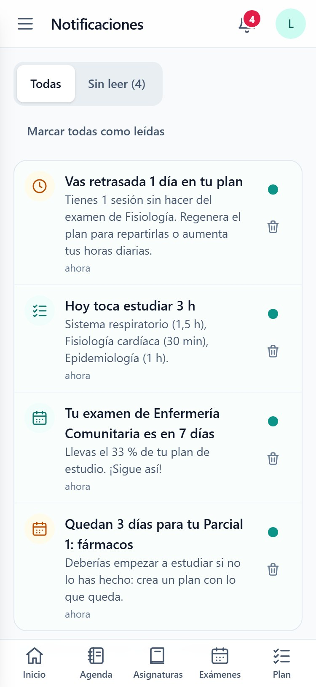
</p>

<details>
<summary>Progreso y estadísticas (captura completa)</summary>

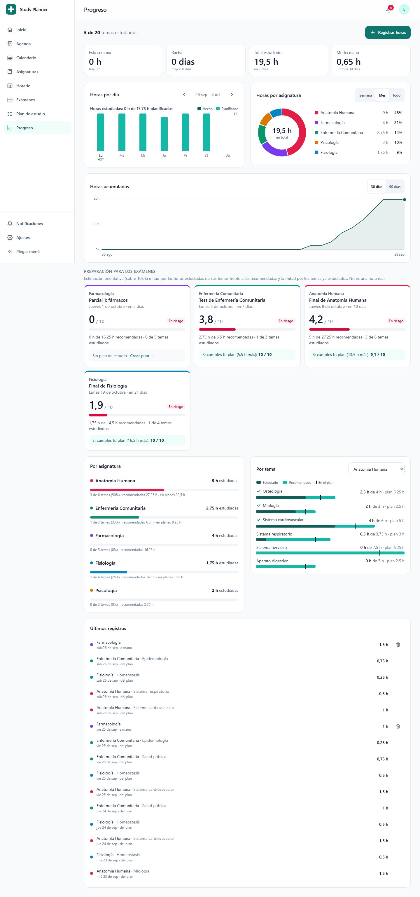

</details>

---

## Arquitectura

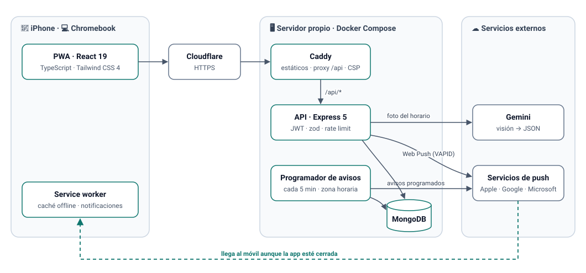

- **Un solo origen:** Caddy sirve la PWA y hace de proxy de `/api`, así que no hay
  CORS y la CSP puede ser estricta (`script-src 'self'`).
- **Todo en Docker Compose:** `./scripts/deploy.sh` levanta o actualiza el
  servidor; hay scripts de copia de seguridad y restauración de MongoDB.
- **Sesiones por dispositivo:** access token JWT de 15 min y refresh token que
  rota en cada uso, guardado por dispositivo (cerrar sesión en el móvil no la
  cierra en el portátil).

---

## Decisiones técnicas

### 1. El generador de planes

El núcleo de la app es una **función pura** (`backend/src/services/planGenerator.js`),
sin base de datos, lo que permite probarla a fondo:

1. **Días disponibles:** desde hoy hasta la víspera del examen, sin los días de
   descanso. La capacidad de cada día es `horas por día − horas que ya ocupan
   otros planes`: dos exámenes a la vez no se pisan.
2. **Tiempo por tema:** `horas estimadas × factor de dificultad` (de ×0,7 para
   los fáciles a ×1,5 para los muy difíciles) y, con repaso, un 25 % más que se
   coloca al final, antes del examen.
3. **Si no da tiempo**, recorta todos los temas en proporción (mínimo 15 min
   cada uno) usando *toda* la capacidad —reparte los cuartos de hora sobrantes
   por mayor resto— y lo avisa. **Si sobra**, reparte la carga uniformemente
   (redondeo acumulado) en lugar de amontonarla en los primeros días.
4. Todo se calcula en **cuartos de hora enteros**, para evitar errores de coma
   flotante.

Al **regenerar**, las sesiones ya completadas se conservan y se descuentan de lo
que falta. Durante el desarrollo se validó con escenarios concretos y **300 casos
aleatorios** que comprueban que nunca se supera la capacidad de un día.

### 2. Notificaciones push en una PWA

- **Las claves VAPID se guardan en la base de datos.** Web Push necesita un par de
  claves del servidor, y todas las suscripciones de los dispositivos quedan
  ligadas a la clave pública: si cambia, dejan de funcionar. Si vinieran solo del
  `.env`, olvidarlas en un despliegue o regenerarlas rompería las notificaciones
  de todos los dispositivos. Por eso la API las **genera en el primer arranque y
  las guarda en MongoDB**: sobreviven a reinicios y despliegues sin configurar
  nada, entran en las copias de seguridad, y aun así se pueden fijar por variable
  de entorno.
- **Seguridad:** el servidor solo acepta suscripciones hacia los servicios de push
  oficiales (Apple, Google, Mozilla, Microsoft). Si no, cualquiera podría usar la
  API para lanzar peticiones a direcciones arbitrarias (SSRF). Las suscripciones
  caducadas (404/410) se borran solas.
- **Un fallo real, depurado en producción:** en el iPhone solo sonaba la primera
  notificación de prueba. Los logs mostraban que Apple aceptaba todos los envíos;
  la causa era que compartían la misma etiqueta (`tag`) y el sistema **sustituía
  la anterior en silencio**. Ahora cada aviso lleva su propia etiqueta (más
  `renotify` por si acaso) y los que provoca la usuaria van con `Urgency: high`.
- **Avisos programados sin duplicados:** cada aviso tiene una clave (tipo + examen
  o día) con índice único en MongoDB, así que el programador puede revisar cada 5
  minutos —o reiniciarse— sin repetir nada. La hora se calcula en la zona horaria
  de la usuaria.

### 3. Modo oscuro sin tocar 800 clases

La interfaz tenía unas 800 clases de color de Tailwind. En lugar de añadir
variantes `dark:` una a una, el modo oscuro **redefine la paleta**: Tailwind 4
expone cada color como variable CSS, así que con `data-tema="oscuro"` en `<html>`
se invierten los grises (el `slate-50` pasa a ser el fondo más oscuro y el
`slate-900` el texto más claro) y los tintes de rojo, ámbar, verde y marca se
oscurecen o aclaran según sean de fondo o de texto.

Lo que no encaja en ese esquema —tarjetas, botones con texto blanco encima,
colores de los gráficos— usa **tokens semánticos** (`bg-superficie`,
`bg-primario`, `bg-peligro`, `--color-grafico-*`). Los colores de los gráficos se
comprobaron con un **validador de paletas** (contraste y distinción) en cada tema.
Para que no haya **destello blanco** al abrir en oscuro, el tema se aplica antes
de pintar con un script externo (la CSP no permite scripts en línea).

### 4. Fechas de calendario, no instantes

Un examen es "el 15 de octubre", no un instante. Se guarda a medianoche UTC y en el
frontend se trata como texto `AAAA-MM-DD`, así el día no cambia según la zona
horaria del servidor o del móvil. Los avisos, en cambio, sí usan la zona horaria
de la usuaria para decidir cuándo es "hoy a las 8:00".

### 5. Escaneo del horario con IA

El backend envía la foto o PDF a un modelo con visión pidiendo **salida JSON con
esquema** y luego la limpia (une bloques contiguos, normaliza horas, descarta lo
inválido). El proveedor está abstraído (Gemini, con Claude como alternativa) y,
como el plan gratuito de Gemini tiene cuota diaria y a veces saturación, usa
**reintentos y una cadena de modelos alternativos**. Con un horario de prueba de
12 clases: imagen 12/12, PDF 11/12 y foto torcida 10/12. Siempre se revisa en la
tabla antes de guardar.

### 6. Otras decisiones

- **Una sola fuente de "horas estudiadas":** completar una sesión del plan crea un
  registro de progreso (y desmarcarla lo borra); las horas apuntadas a mano van al
  mismo sitio. Al arrancar, una migración idempotente crea los registros de
  sesiones completadas antes de existir esta función.
- **Cambios sensibles con contraseña:** el nombre y el email piden la contraseña
  (con límite de intentos); la foto de perfil no, pero el servidor comprueba los
  bytes iniciales para asegurarse de que es de verdad una imagen.
- **Accesibilidad medida, no supuesta:** se auditaron automáticamente las 12
  pantallas en 5 resoluciones y 2 temas con **axe-core**, además de comprobar
  dianas táctiles, cursores y desbordamiento horizontal, hasta dejarlo en 0
  problemas.

---

## Estructura

```
backend/    API Express: controllers, models (Mongoose), routes, services
            (generador de planes, push, avisos, escaneo), validators (zod)
frontend/   PWA React: pages, components, hooks, lib, service-worker.js
docs/       Guía técnica (despliegue, desarrollo, API) e imágenes
scripts/    deploy.sh · backup.sh · restore.sh
```

## Puesta en marcha

```bash
git clone https://github.com/gsan-dev/study-planner-enfermeria.git
cd study-planner-enfermeria
./scripts/deploy.sh            # crea .env con secretos aleatorios y levanta todo
```

Desarrollo con recarga en caliente: `docker compose -f docker-compose.dev.yml up --build`.
Despliegue con dominio y HTTPS, variables de entorno, API completa y copias de
seguridad: **[docs/DESARROLLO.md](docs/DESARROLLO.md)**.

---

Hecho por [gsan-dev](https://github.com/gsan-dev).
